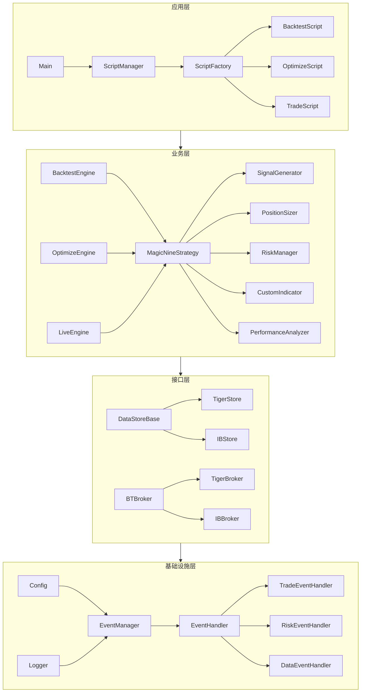
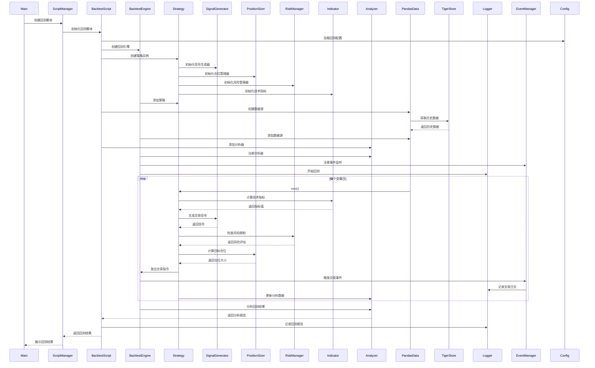
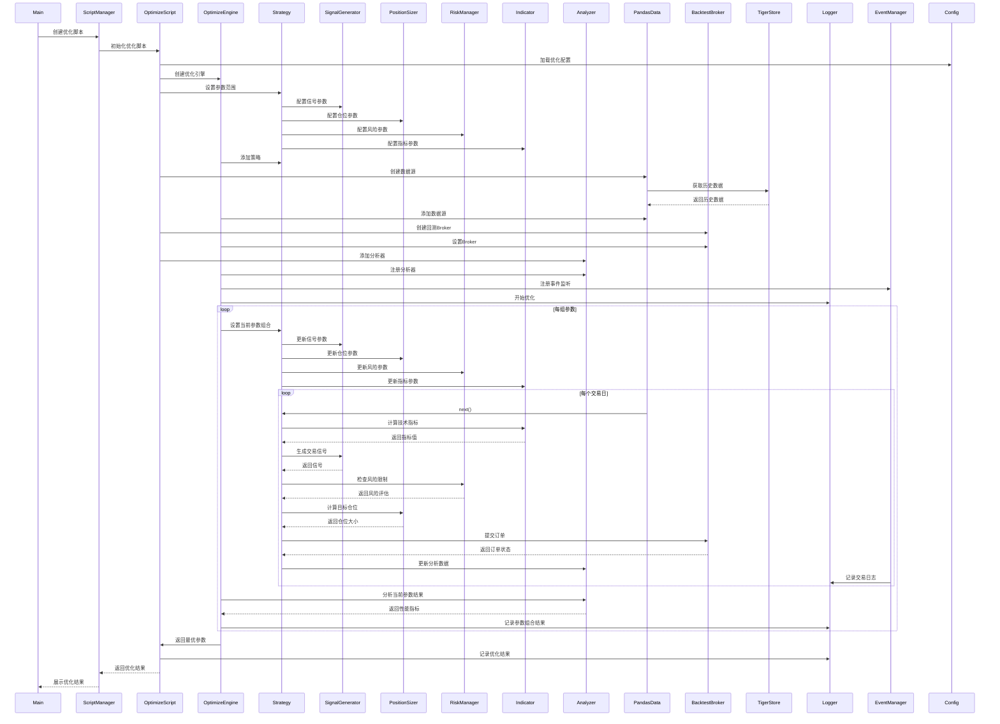
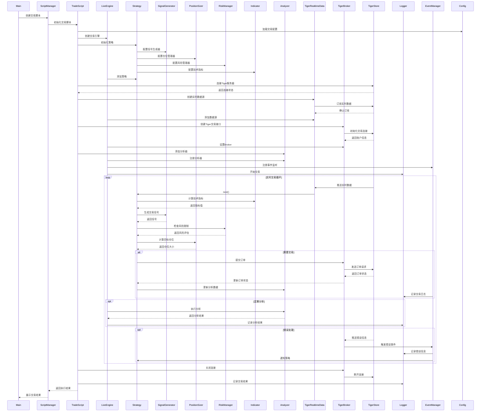

# 项目架构设计图

## 目录

1. [工程结构](#工程结构)
   - [目录结构说明](#目录结构说明)
     - [配置文件目录](#1-配置文件目录-configs)
     - [源代码目录](#2-源代码目录-src)
     - [研究目录](#3-研究目录-research)
     - [日志目录](#4-日志目录-logs)
     - [输出目录](#5-输出目录-outputs)
     - [测试目录](#6-测试目录-tests)

2. [分层架构](#分层架构)
   - [分层说明](#分层说明)
     - [应用层](#1-应用层)
     - [业务层](#2-业务层)
     - [接口层](#3-接口层)
     - [基础设施层](#4-基础设施层)
   - [依赖关系说明](#依赖关系说明)

3. [关键流程时序图](#关键流程时序图)
   - [回测流程](#1-回测流程)
   - [参数优化流程](#2-参数优化流程)
   - [实盘交易流程](#3-实盘交易流程)
   - [流程说明](#流程说明)

4. [分层架构类图](#分层架构类图)
   - [类关系说明](#类关系说明)

## 工程结构

```
nine_turn_strategy/
├── architecture_diagram.md
├── src/
│   ├── application/
│   │   ├── __init__.py
│   │   ├── main.py
│   │   ├── script_manager.py
│   │   ├── script_factory.py
│   │   └── scripts/
│   │       ├── __init__.py
│   │       ├── backtest_script.py
│   │       ├── optimize_script.py
│   │       └── trade_script.py
│   ├── business/
│   │   ├── __init__.py
│   │   ├── strategy/
│   │   │   ├── __init__.py
│   │   │   ├── base_strategy.py
│   │   │   ├── magic_nine.py
│   │   │   ├── signal_generator.py
│   │   │   ├── position_sizer.py
│   │   │   └── risk_manager.py
│   │   ├── indicators/
│   │   │   ├── __init__.py
│   │   │   ├── base_indicator.py
│   │   │   └── custom_indicators.py
│   │   ├── analyzers/
│   │   │   ├── __init__.py
│   │   │   ├── base_analyzer.py
│   │   │   ├── performance_analyzer.py
│   │   │   └── risk_analyzer.py
│   │   └── engines/
│   │       ├── __init__.py
│   │       ├── base_engine.py
│   │       ├── backtest_engine.py
│   │       ├── optimize_engine.py
│   │       └── live_engine.py
│   ├── interface/
│   │   ├── __init__.py
│   │   ├── data/
│   │   │   ├── __init__.py
│   │   │   ├── base_data.py
│   │   │   ├── pandas_data.py
│   │   │   ├── csv_data.py
│   │   │   └── realtime_data.py
│   │   ├── store/
│   │   │   ├── __init__.py
│   │   │   ├── base_store.py
│   │   │   ├── tiger_store.py
│   │   │   └── ib_store.py
│   │   └── broker/
│   │       ├── __init__.py
│   │       ├── base_broker.py
│   │       ├── backtest_broker.py
│   │       ├── tiger/
│   │       │   ├── __init__.py
│   │       │   ├── tiger_broker.py
│   │       │   ├── tiger_client.py
│   │       │   ├── tiger_config.py
│   │       │   ├── tiger_contract.py
│   │       │   ├── tiger_data.py
│   │       │   ├── tiger_market.py
│   │       │   ├── tiger_order.py
│   │       │   └── examples/
│   │       │       ├── __init__.py
│   │       │       ├── push_client_demo.py
│   │       │       ├── quote_client_demo.py
│   │       │       ├── trade_client_demo.py
│   │       │       ├── financial_demo.py
│   │       │       ├── nasdaq100.py
│   │       │       └── backtrader_tiger_live_trading_demo.py
│   │       └── ib/
│   │           ├── __init__.py
│   │           ├── ib_broker.py
│   │           ├── client.py
│   │           ├── client_config.py
│   │           ├── config.py
│   │           ├── contract.py
│   │           ├── data.py
│   │           ├── market.py
│   │           └── order.py
│   └── infrastructure/
│       ├── __init__.py
│       ├── config/
│       │   ├── __init__.py
│       │   ├── base_config.py
│       │   ├── strategy_config.py
│       │   └── data_config.py
│       ├── logging/
│       │   ├── __init__.py
│       │   └── logger.py
│       └── event/
│           ├── __init__.py
│           └── event_manager.py
├── configs/
│   ├── data/
│   │       ib_config.yaml
│   ├── strategy/
│   │       backtest.yaml
│   │       common.yaml
│   │       live.yaml
│   │       magic_nine.yaml
│   │       optimization.yaml
│   │       symbol_params.json
│   └── tiger/
│           private_key.pem
│           tiger_openapi_config.properties
├── research/
│   ├── data/
│   │   ├── raw/
│   │   └── processed/
│   ├── notebooks/
│   │   ├── strategy_development/
│   │   └── backtest_analysis/
│   └── reports/
│       ├── strategy/
│       └── backtest/
├── logs/
│   ├── backtest/
│   └── live/
├── outputs/
│   ├── backtest/
│   │   ├── results/
│   │   └── charts/
│   └── live/
│       ├── trades/
│       └── positions/
└── tests/
    ├── __init__.py
    ├── unit/
    │   ├── __init__.py
    │   ├── test_strategy.py
    │   ├── test_indicators.py
    │   └── test_analyzers.py
    └── integration/
        ├── __init__.py
        ├── test_backtest.py
        └── test_live.py
```

## 目录结构说明

### 1. 配置文件目录 (configs/)
- **strategy/**: 策略配置
  - magic_nine.yaml: 策略配置文件
  - risk_control.yaml: 风险控制配置文件
- **data/**: 数据源配置
  - tiger_config.yaml: 老虎证券配置文件
  - ib_config.yaml: Interactive Brokers配置文件

### 2. 源代码目录 (src/)
- **application/**: 应用程序模块
  - main.py: 主程序入口
  - scripts/: 脚本模块
- **business/**: 业务模块
  - strategy/: 策略模块
  - indicators/: 技术指标模块
  - analyzers/: 分析器模块
  - engines/: 引擎模块
- **interface/**: 接口模块
  - data/: 数据接口
- **infrastructure/**: 基础设施模块
  - config/: 配置管理
  - logging/: 日志管理
  - event/: 事件管理

### 3. 研究目录 (research/)
- **data/**: 研究数据
- **notebooks/**: 研究笔记
- **reports/**: 研究报告

### 4. 日志目录 (logs/)
- **backtest/**: 回测日志
- **live/**: 实盘日志

### 5. 输出目录 (outputs/)
- **backtest/**: 回测结果
- **live/**: 实盘结果

### 6. 测试目录 (tests/)
- 单元测试和集成测试文件

## 分层架构



## 分层说明

### 1. 应用层
- **主程序入口**：负责程序的启动和整体流程控制
- **脚本管理**：提供各种运行脚本，如回测、优化、实盘等

### 2. 业务层
- **策略模块**：提供策略开发的基础框架
- **技术指标**：提供技术指标计算功能
- **分析器**：提供策略分析功能
- **引擎**：提供策略回测、优化和实盘交易功能

### 3. 接口层
- **券商接口**：对接不同券商的交易接口
- **数据接口**：提供市场数据获取功能

### 4. 基础设施层
- **配置管理**：管理所有配置信息
- **日志系统**：提供日志记录功能
- **事件系统**：提供事件管理功能
- **测试系统**：提供测试支持
- **研究模块**：提供研究支持

### 依赖关系说明
1. 上层模块可以依赖下层模块，但下层模块不能依赖上层模块
2. 同层模块之间可以有依赖关系，但应尽量减少
3. 依赖关系应该是单向的，避免循环依赖
4. 基础设施层为所有上层模块提供基础服务 

## 关键流程时序图

### 1. 回测流程



### 2. 参数优化流程



### 3. 实盘交易流程



## 流程说明

### 1. 回测流程说明
1. **初始化阶段**
   - 加载回测配置
   - 创建回测引擎
   - 初始化策略组件（信号生成器、仓位管理器、风险管理器、技术指标）
   - 加载历史数据
   - 注册分析器和事件监听

2. **回测执行阶段**
   - 遍历每个交易日数据
   - 计算技术指标
   - 生成交易信号
   - 进行风险评估
   - 计算交易仓位
   - 执行交易指令
   - 记录交易日志
   - 更新分析数据

3. **结果分析阶段**
   - 生成回测报告
   - 计算性能指标
   - 输出分析结果

### 2. 参数优化流程说明
1. **初始化阶段**
   - 加载优化配置
   - 设置参数优化范围
   - 创建优化引擎
   - 准备数据和分析器

2. **优化执行阶段**
   - 遍历每组参数组合
   - 使用当前参数执行回测
   - 收集性能指标
   - 记录优化过程

3. **结果处理阶段**
   - 选择最优参数组合
   - 生成优化报告
   - 保存优化结果

### 3. 实盘交易流程说明
1. **初始化阶段**
   - 加载交易配置
   - 连接券商接口
   - 初始化策略组件
   - 订阅实时数据
   - 设置风险控制

2. **交易执行阶段**
   - 接收实时行情
   - 实时计算指标
   - 生成交易信号
   - 风险评估
   - 发送交易指令
   - 处理成交回报
   - 记录交易日志

3. **监控和维护**
   - 异常处理机制
   - 风险控制措施
   - 定期状态分析
   - 实时监控告警

## 分层架构类图

```mermaid
classDiagram
    %% 数据源基类
    class DataStoreBase {
        <<abstract>>
        +start()
        +stop()
        +get_data()
        +get_realtime_quotes()
        +get_historical_data()
    }

    %% Backtrader核心类
    class BTBroker {
        <<abstract>>
        +__init__()
        +submit_order()
        +cancel_order()
        +get_cash()
        +get_value()
        +get_position()
    }
    class BTDataBase {
        <<abstract>>
        +start()
        +stop()
        +_load()*
        +haslivedata()
        +put_notification()
    }
    class BTStrategy {
        <<abstract>>
        +__init__()
        +next()*
        +notify_order()
        +notify_trade()
    }
    class BTIndicator {
        <<abstract>>
        +__init__()
        +next()*
    }
    class BTAnalyzer {
        <<abstract>>
        +__init__()
        +next()*
        +get_analysis()
    }
    class BTSizer {
        <<abstract>>
        +__init__()
        +_getsizing()*
    }

    %% 数据源类
    class PandasData {
        +__init__(dataname: DataFrame)
        +start()
        +_load()
    }
    class GenericCSVData {
        +__init__(dataname: str)
        +start()
        +_load()
    }
    class TigerRealtimeData {
        +__init__()
        +start()
        +_load()
        -last_time
        -market_open
        -contract
    }

    %% 数据存储类
    class TigerStore {
        +start()
        +stop()
        +get_data()
        +get_realtime_quotes()
        +get_historical_data()
        -_connect_api()
        -_handle_response()
    }
    class IBStore {
        +start()
        +stop()
        +get_data()
        +get_realtime_quotes()
        +get_historical_data()
        -_connect_api()
        -_handle_response()
    }

    %% Broker类
    class BacktestBroker {
        +__init__()
        +submit_order()
        +cancel_order()
        +get_cash()
        +get_value()
        +get_position()
        -_process_order()
        -_update_position()
    }
    class TigerBroker {
        +__init__()
        +submit_order()
        +cancel_order()
        +get_cash()
        +get_value()
        +get_position()
        -_connect_api()
        -_handle_response()
    }
    class IBBroker {
        +__init__()
        +submit_order()
        +cancel_order()
        +get_cash()
        +get_value()
        +get_position()
        -_connect_api()
        -_handle_response()
    }

    %% 事件处理类
    class EventHandler {
        <<abstract>>
        +handle_event()
        +process_event()
    }
    class TradeEventHandler {
        +handle_event()
        +process_event()
        -_process_trade()
    }
    class RiskEventHandler {
        +handle_event()
        +process_event()
        -_process_risk()
    }
    class DataEventHandler {
        +handle_event()
        +process_event()
        -_process_data()
    }

    %% 应用层
    class Main {
        +run()
        +initialize()
        +shutdown()
    }
    class ScriptManager {
        +create_script()
        +run_script()
        +stop_script()
    }
    class ScriptFactory {
        +create_backtest_script()
        +create_optimize_script()
        +create_trade_script()
    }
    class BacktestScript {
        +run()
        +stop()
        +analyze()
    }
    class OptimizeScript {
        +run()
        +stop()
        +optimize()
    }
    class TradeScript {
        +run()
        +stop()
        +trade()
    }

    %% 业务层
    class MagicNineStrategy {
        +__init__()
        +next()
        +notify_order()
        +notify_trade()
        +generate_signals()
        +manage_position()
    }
    class SignalGenerator {
        +generate_signal()
        +update_signal()
        +clear_signal()
    }
    class PositionSizer {
        +__init__()
        +_getsizing()
        +update_position()
    }
    class RiskManager {
        +__init__()
        +next()
        +get_analysis()
        +check_risk()
    }
    class CustomIndicator {
        +__init__()
        +next()
        +calculate()
    }
    class PerformanceAnalyzer {
        +__init__()
        +next()
        +get_analysis()
    }
    class BacktestEngine {
        +run()
        +stop()
        +analyze()
    }
    class OptimizeEngine {
        +run()
        +stop()
        +optimize()
    }
    class LiveEngine {
        +run()
        +stop()
        +trade()
    }

    %% 基础设施层
    class Logger {
        +log_info()
        +log_warning()
        +log_error()
    }
    class Config {
        +load_config()
        +save_config()
        +validate_config()
    }
    class EventManager {
        +register_event()
        +unregister_event()
        +trigger_event()
        -_process_event()
    }

    %% 继承关系
    DataStoreBase <|-- TigerStore
    DataStoreBase <|-- IBStore
    BTBroker <|-- BacktestBroker
    BTBroker <|-- TigerBroker
    BTBroker <|-- IBBroker
    BTStrategy <|-- MagicNineStrategy
    BTSizer <|-- PositionSizer
    BTAnalyzer <|-- RiskManager
    BTAnalyzer <|-- PerformanceAnalyzer
    BTIndicator <|-- CustomIndicator
    BTDataBase <|-- PandasData
    BTDataBase <|-- GenericCSVData
    BTDataBase <|-- TigerRealtimeData
    EventHandler <|-- TradeEventHandler
    EventHandler <|-- RiskEventHandler
    EventHandler <|-- DataEventHandler

    %% 应用层关系
    Main --> ScriptManager
    ScriptManager --> ScriptFactory
    ScriptFactory --> BacktestScript
    ScriptFactory --> OptimizeScript
    ScriptFactory --> TradeScript

    %% 业务层关系
    MagicNineStrategy --> SignalGenerator
    MagicNineStrategy --> PositionSizer
    MagicNineStrategy --> RiskManager
    MagicNineStrategy --> CustomIndicator
    MagicNineStrategy --> PerformanceAnalyzer
    BacktestScript --> BacktestEngine
    OptimizeScript --> OptimizeEngine
    TradeScript --> LiveEngine

    %% 数据流关系
    BacktestScript ..> PandasData
    BacktestScript ..> GenericCSVData
    BacktestScript ..> MagicNineStrategy
    TradeScript ..> TigerRealtimeData
    TradeScript ..> MagicNineStrategy
    TigerRealtimeData ..> TigerStore
    PandasData ..> TigerStore
    GenericCSVData ..> TigerStore

    %% 事件处理关系
    EventManager --> EventHandler
    EventManager --> Logger
    EventManager --> MagicNineStrategy
    EventManager --> TigerBroker
    EventManager --> TigerRealtimeData

    %% 基础设施层关系
    Logger --> EventManager
    Config --> EventManager
```



## 类关系说明

### 1. 数据源体系
- **DataStoreBase**: 数据存储基类，定义标准接口
  - **TigerStore**: 老虎证券数据存储实现
  - **IBStore**: Interactive Brokers数据存储实现
- **BTDataBase**: backtrader框架的抽象数据源基类
  - **PandasData**: 用于回测的DataFrame数据源
  - **GenericCSVData**: 用于回测的CSV文件数据源
  - **TigerRealtimeData**: 用于实盘的Tiger实时数据源

### 2. 引擎体系
- **BacktestEngine**: 回测引擎
  - 管理回测流程
  - 控制数据回放
  - 处理交易执行
  - 收集回测结果
- **OptimizeEngine**: 优化引擎
  - 管理参数优化流程
  - 控制参数组合生成
  - 评估策略性能
  - 选择最优参数
- **LiveEngine**: 实盘引擎
  - 管理实时交易流程
  - 控制数据订阅
  - 处理实时交易
  - 监控系统状态

### 3. 事件处理体系
- **EventManager**: 事件管理器
  - 注册事件处理器
  - 分发事件
  - 管理事件优先级
  - 处理异常事件
- **EventHandler**: 事件处理器基类
  - **TradeEventHandler**: 处理交易相关事件
  - **RiskEventHandler**: 处理风险相关事件
  - **DataEventHandler**: 处理数据相关事件

### 4. 配置管理体系
- **Config**: 配置管理器
  - 加载配置文件
  - 管理配置项
  - 验证配置有效性
  - 支持配置热更新
- 配置分类：
  - 系统配置
  - 策略配置
  - 数据源配置
  - 交易配置
  - 风险配置

### 5. 日志管理体系
- **Logger**: 日志管理器
  - 日志级别管理
  - 日志格式控制
  - 日志文件管理
  - 日志轮转策略
- 日志分类：
  - 系统日志
  - 交易日志
  - 错误日志
  - 性能日志

### 6. 错误处理机制
- 错误分类：
  - 系统错误
  - 交易错误
  - 数据错误
  - 网络错误
- 错误处理策略：
  - 自动重试
  - 降级处理
  - 告警通知
  - 错误恢复

### 7. 性能监控体系
- 监控指标：
  - 系统资源使用
  - 交易执行性能
  - 数据处理性能
  - 网络延迟
- 告警机制：
  - 阈值告警
  - 趋势告警
  - 异常检测
  - 告警通知

### 8. 测试支持体系
- 测试类型：
  - 单元测试
  - 集成测试
  - 回测验证
  - 实盘模拟
- 测试工具：
  - 测试框架
  - 数据生成器
  - 性能分析器
  - 覆盖率工具 