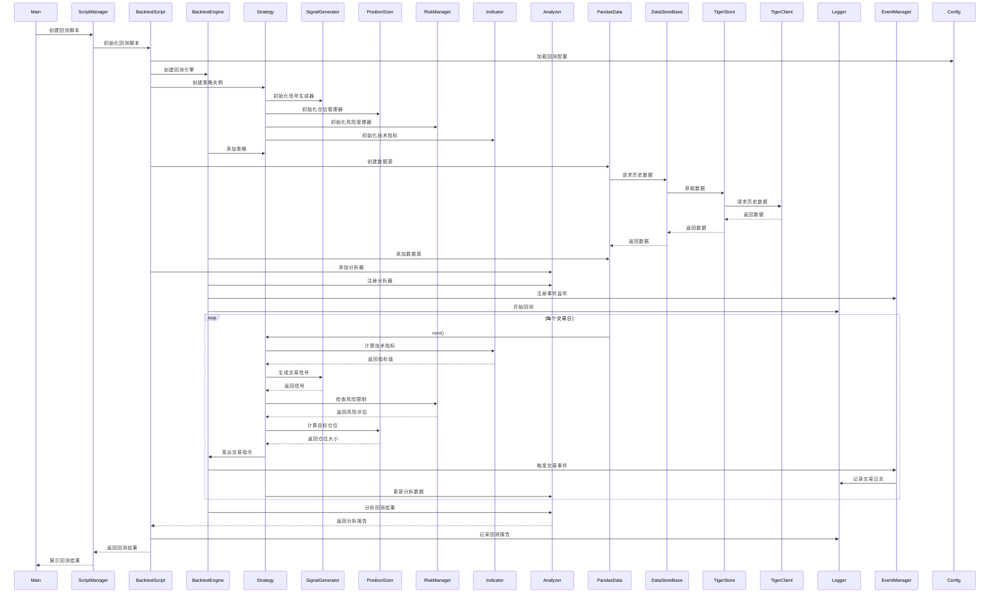
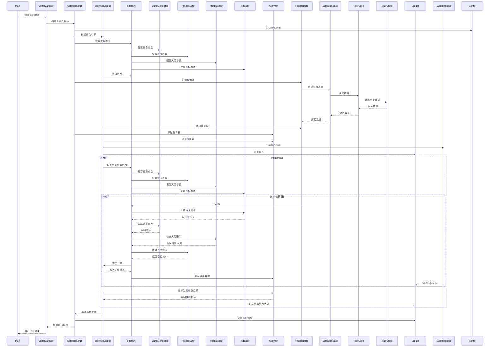
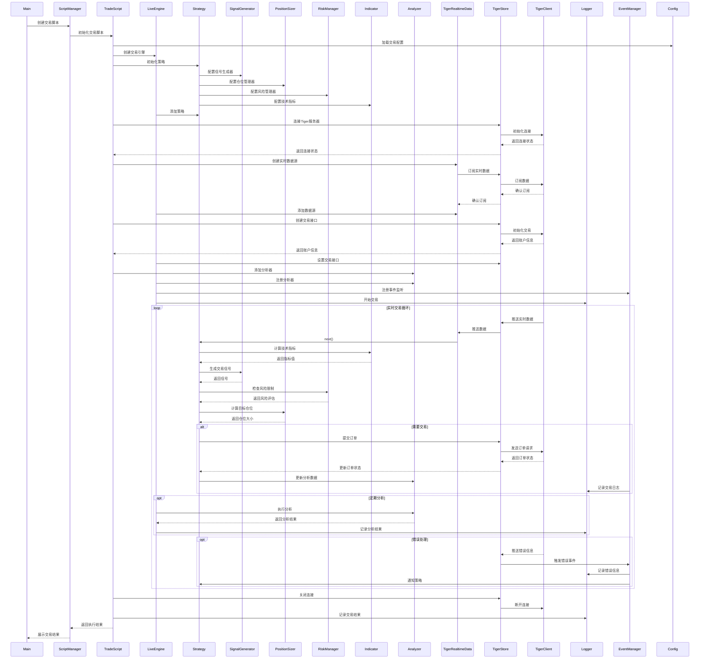

# 项目架构设计图

## 目录

1. [工程结构](#工程结构)
   - [目录结构说明](#目录结构说明)
     - [配置文件目录](#1-配置文件目录-configs)
     - [源代码目录](#2-源代码目录-src)
     - [研究目录](#3-研究目录-research)
     - [日志目录](#4-日志目录-logs)
     - [输出目录](#5-输出目录-outputs)
     - [测试目录](#6-测试目录-tests)

2. [分层架构](#分层架构)
   - [分层说明](#分层说明)
     - [应用层](#1-应用层)
     - [业务层](#2-业务层)
     - [接口层](#3-接口层)
     - [基础设施层](#4-基础设施层)
   - [依赖关系说明](#依赖关系说明)

3. [关键流程时序图](#关键流程时序图)
   - [回测流程](#1-回测流程)
   - [参数优化流程](#2-参数优化流程)
   - [实盘交易流程](#3-实盘交易流程)
   - [数据加载流程](#4-数据加载流程)
   - [流程说明](#流程说明)

4. [分层架构类图](#分层架构类图)
   - [类关系说明](#类关系说明)

## 工程结构

```
nine_turn_strategy/
├── architecture_diagram.md
├── src/
│   ├── application/
│   │   ├── __init__.py
│   │   ├── main.py
│   │   ├── script_manager.py
│   │   ├── script_factory.py
│   │   └── scripts/
│   │       ├── __init__.py
│   │       ├── backtest_script.py
│   │       ├── optimize_script.py
│   │       └── trade_script.py
│   ├── business/
│   │   ├── __init__.py
│   │   ├── strategy/
│   │   │   ├── __init__.py
│   │   │   ├── base_strategy.py
│   │   │   ├── magic_nine.py
│   │   │   ├── signal_generator.py
│   │   │   ├── position_sizer.py
│   │   │   └── risk_manager.py
│   │   ├── indicators/
│   │   │   ├── __init__.py
│   │   │   ├── base_indicator.py
│   │   │   └── custom_indicators.py
│   │   ├── analyzers/
│   │   │   ├── __init__.py
│   │   │   ├── base_analyzer.py
│   │   │   ├── performance_analyzer.py
│   │   │   └── risk_analyzer.py
│   │   └── engines/
│   │       ├── __init__.py
│   │       ├── base_engine.py
│   │       ├── backtest_engine.py
│   │       ├── optimize_engine.py
│   │       └── live_engine.py
│   ├── interface/
│   │   ├── __init__.py
│   │   ├── data/
│   │   │   ├── __init__.py
│   │   │   ├── base_data.py
│   │   │   ├── pandas_data.py
│   │   │   ├── csv_data.py
│   │   │   └── realtime_data.py
│   │   ├── store/
│   │   │   ├── __init__.py
│   │   │   ├── base_store.py
│   │   │   ├── tiger_store.py
│   │   │   └── ib_store.py
│   │   └── broker/
│   │       ├── __init__.py
│   │       ├── base_broker.py
│   │       ├── backtest_broker.py
│   │       ├── tiger/
│   │       │   ├── __init__.py
│   │       │   ├── tiger_broker.py
│   │       │   ├── tiger_client.py
│   │       │   ├── tiger_config.py
│   │       │   ├── tiger_contract.py
│   │       │   ├── tiger_data.py
│   │       │   ├── tiger_market.py
│   │       │   ├── tiger_order.py
│   │       │   └── examples/
│   │       │       ├── __init__.py
│   │       │       ├── push_client_demo.py
│   │       │       ├── quote_client_demo.py
│   │       │       ├── trade_client_demo.py
│   │       │       ├── financial_demo.py
│   │       │       ├── nasdaq100.py
│   │       │       └── backtrader_tiger_live_trading_demo.py
│   │       └── ib/
│   │           ├── __init__.py
│   │           ├── ib_broker.py
│   │           ├── client.py
│   │           ├── client_config.py
│   │           ├── config.py
│   │           ├── contract.py
│   │           ├── data.py
│   │           ├── market.py
│   │           └── order.py
│   └── infrastructure/
│       ├── __init__.py
│       ├── config/
│       │   ├── __init__.py
│       │   ├── base_config.py
│       │   ├── strategy_config.py
│       │   └── data_config.py
│       ├── logging/
│       │   ├── __init__.py
│       │   └── logger.py
│       └── event/
│           ├── __init__.py
│           └── event_manager.py
├── configs/
│   ├── data/
│   │       ib_config.yaml
│   ├── strategy/
│   │       backtest.yaml
│   │       common.yaml
│   │       live.yaml
│   │       magic_nine.yaml
│   │       optimization.yaml
│   │       symbol_params.json
│   └── tiger/
│           private_key.pem
│           tiger_openapi_config.properties
├── research/
│   ├── data/
│   │   ├── raw/
│   │   └── processed/
│   ├── notebooks/
│   │   ├── strategy_development/
│   │   └── backtest_analysis/
│   └── reports/
│       ├── strategy/
│       └── backtest/
├── logs/
│   ├── backtest/
│   └── live/
├── outputs/
│   ├── backtest/
│   │   ├── results/
│   │   └── charts/
│   └── live/
│       ├── trades/
│       └── positions/
└── tests/
    ├── __init__.py
    ├── unit/
    │   ├── __init__.py
    │   ├── test_strategy.py
    │   ├── test_indicators.py
    │   └── test_analyzers.py
    └── integration/
        ├── __init__.py
        ├── test_backtest.py
        └── test_live.py
```

## 目录结构说明

### 1. 配置文件目录 (configs/)
- **strategy/**: 策略配置
  - magic_nine.yaml: 策略配置文件
  - risk_control.yaml: 风险控制配置文件
- **data/**: 数据源配置
  - tiger_config.yaml: 老虎证券配置文件
  - ib_config.yaml: Interactive Brokers配置文件

### 2. 源代码目录 (src/)
- **application/**: 应用程序模块
  - main.py: 主程序入口
  - scripts/: 脚本模块
- **business/**: 业务模块
  - strategy/: 策略模块
  - indicators/: 技术指标模块
  - analyzers/: 分析器模块
  - engines/: 引擎模块
- **interface/**: 接口模块
  - data/: 数据接口
- **infrastructure/**: 基础设施模块
  - config/: 配置管理
  - logging/: 日志管理
  - event/: 事件管理

### 3. 研究目录 (research/)
- **data/**: 研究数据
- **notebooks/**: 研究笔记
- **reports/**: 研究报告

### 4. 日志目录 (logs/)
- **backtest/**: 回测日志
- **live/**: 实盘日志

### 5. 输出目录 (outputs/)
- **backtest/**: 回测结果
- **live/**: 实盘结果

### 6. 测试目录 (tests/)
- 单元测试和集成测试文件

## 分层架构


## 分层说明

### 1. 应用层
- **主程序入口**：负责程序的启动和整体流程控制
- **脚本管理**：提供各种运行脚本，如回测、优化、实盘等

### 2. 业务层
- **策略模块**：提供策略开发的基础框架
- **技术指标**：提供技术指标计算功能
- **分析器**：提供策略分析功能
- **引擎**：提供策略回测、优化和实盘交易功能

### 3. 接口层
- **券商接口**：对接不同券商的交易接口
- **数据接口**：提供市场数据获取功能

### 4. 基础设施层
- **配置管理**：管理所有配置信息
- **日志系统**：提供日志记录功能
- **事件系统**：提供事件管理功能
- **测试系统**：提供测试支持
- **研究模块**：提供研究支持

### 依赖关系说明
1. 上层模块可以依赖下层模块，但下层模块不能依赖上层模块
2. 同层模块之间可以有依赖关系，但应尽量减少
3. 依赖关系应该是单向的，避免循环依赖
4. 基础设施层为所有上层模块提供基础服务 

## 关键流程时序图

### 1. 回测流程



### 2. 参数优化流程



### 3. 实盘交易流程



### 4. 数据加载流程


数据加载流程说明：
1. **初始化阶段**
   - `Main`创建`BacktestScript`实例
   - `BacktestScript`创建`BacktestEngine`和`PandasData`实例
   - `PandasData`通过`TigerStore`请求历史数据

2. **数据获取阶段**
   - `TigerStore`首先检查本地CSV缓存
   - 如果缓存未命中，则通过`TigerClient`从API获取数据
   - 采用分段获取策略，每段最多5天
   - 获取的数据保存为CSV文件

3. **数据处理阶段**
   - `TigerStore`将数据转换为DataFrame格式
   - 数据包含时间索引和OHLCV数据
   - 时间使用UTC格式

4. **数据验证阶段**
   - `MagicNineStrategy`对数据进行验证
   - 检查数据完整性（每个交易日390个数据点）
   - 检查数据连续性（1分钟间隔）
   - 检查数据点数量（允许90%的完整度）

5. **数据使用阶段**
   - 数据加载完成后，`BacktestEngine`将数据源添加到回测引擎
   - `MagicNineStrategy`使用加载的数据进行回测
   - 策略在回测过程中可以访问完整的历史数据

## 流程说明

1. 回测数据加载流程：
   - `PandasData/GenericCSVData` 调用 `DataStoreBase` 的 `get_historical_data` 方法
   - `DataStoreBase` 将请求转发给 `TigerStore`
   - `TigerStore` 首先检查缓存
   - 如果缓存存在，直接返回缓存数据
   - 如果缓存不存在，通过 `TigerClient` 从 API 获取数据
   - 获取到数据后保存到缓存并返回

2. 实盘数据加载流程：
   - `PandasData/GenericCSVData` 调用 `DataStoreBase` 的 `get_realtime_quotes` 方法
   - `DataStoreBase` 将请求转发给 `TigerStore`
   - `TigerStore` 通过 `TigerClient` 订阅实时行情
   - `TigerClient` 从 API 获取实时行情并返回

3. 数据流向：
   - 回测数据流：`PandasData/GenericCSVData -> DataStoreBase -> TigerStore -> TigerClient -> API`
   - 实盘数据流：`PandasData/GenericCSVData -> DataStoreBase -> TigerStore -> TigerClient -> API`
   - 缓存管理：`TigerStore` 负责缓存的管理，包括检查、保存和读取

## 分层架构类图


## 类关系说明

1. 数据存储层：
   - `DataStoreBase` 是数据存储的抽象基类，位于 `src/interface/store/` 目录
   - 定义了数据存储的接口规范
   - `TigerStore` 和 `IBStore` 继承自 `DataStoreBase`，实现具体的数据存储逻辑

2. 数据源层：
   - `BTDataBase` 是数据源的抽象基类
   - 包含 `_store` 属性，用于访问数据存储
   - `PandasData`、`GenericCSVData` 和 `TigerRealtimeData` 继承自 `BTDataBase`

3. 数据流向：
   - 回测数据流：`PandasData/GenericCSVData -> DataStoreBase -> TigerStore -> TigerClient -> API`
   - 实盘数据流：`PandasData/GenericCSVData -> DataStoreBase -> TigerStore -> TigerClient -> API`
   - 经纪商数据流：`TigerBroker -> TigerStore -> TigerClient -> API` 和 `IBBroker -> IBStore -> IBClient -> API`