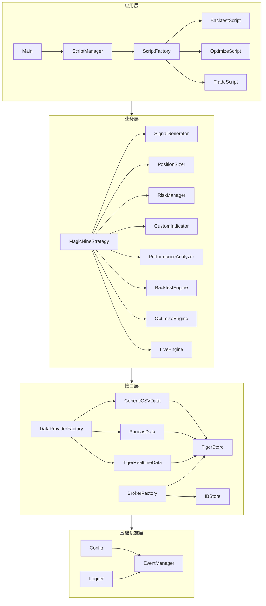
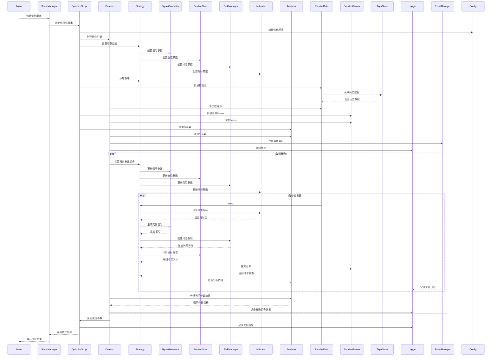

# 项目架构设计图

## 目录

1. [工程结构](#工程结构)
   - [目录结构说明](#目录结构说明)
     - [配置文件目录](#1-配置文件目录-configs)
     - [源代码目录](#2-源代码目录-src)
     - [研究目录](#3-研究目录-research)
     - [日志目录](#4-日志目录-logs)
     - [输出目录](#5-输出目录-outputs)
     - [测试目录](#6-测试目录-tests)

2. [分层架构](#分层架构)
   - [分层说明](#分层说明)
     - [应用层](#1-应用层)
     - [业务层](#2-业务层)
     - [接口层](#3-接口层)
     - [基础设施层](#4-基础设施层)
   - [依赖关系说明](#依赖关系说明)

3. [关键流程时序图](#关键流程时序图)
   - [回测流程](#1-回测流程)
   - [参数优化流程](#2-参数优化流程)
   - [实盘交易流程](#3-实盘交易流程)
   - [流程说明](#流程说明)

4. [分层架构类图](#分层架构类图)
   - [类关系说明](#类关系说明)

## 工程结构

```
nine_turn_strategy/
├── architecture_diagram.md
├── main.py
├── src/
│   ├── application/
│   │   ├── __init__.py
│   │   ├── main.py
│   │   ├── script_manager.py
│   │   ├── script_factory.py
│   │   └── scripts/
│   │       ├── __init__.py
│   │       ├── backtest_script.py
│   │       ├── optimize_script.py
│   │       └── trade_script.py
│   ├── business/
│   │   ├── __init__.py
│   │   ├── strategy/
│   │   │   ├── __init__.py
│   │   │   ├── base_strategy.py
│   │   │   ├── magic_nine.py
│   │   │   ├── signal_generator.py
│   │   │   ├── position_sizer.py
│   │   │   └── risk_manager.py
│   │   ├── indicators/
│   │   │   ├── __init__.py
│   │   │   ├── base_indicator.py
│   │   │   └── custom_indicators.py
│   │   ├── analyzers/
│   │   │   ├── __init__.py
│   │   │   ├── base_analyzer.py
│   │   │   ├── performance_analyzer.py
│   │   │   └── risk_analyzer.py
│   │   └── engines/
│   │       ├── __init__.py
│   │       ├── backtest_engine.py
│   │       ├── optimize_engine.py
│   │       └── live_engine.py
│   ├── interface/
│   │   ├── __init__.py
│   │   ├── broker/
│   │   │   ├── __init__.py
│   │   │   ├── base_broker.py
│   │   │   ├── backtest_broker.py
│   │   │   ├── tiger_broker.py
│   │   │   └── ib_broker.py
│   │   └── data/
│   │       ├── __init__.py
│   │       ├── base_data.py
│   │       ├── pandas_data.py
│   │       ├── csv_data.py
│   │       └── realtime_data.py
│   └── infrastructure/
│       ├── __init__.py
│       ├── config/
│       │   ├── __init__.py
│       │   └── config.py
│       ├── logging/
│       │   ├── __init__.py
│       │   └── logger.py
│       └── event/
│           ├── __init__.py
│           └── event_manager.py
├── configs/
│   ├── tiger/
│   │   ├── private_key.pem
│   │   └── tiger_openapi_config.properties
│   └── ib/
│       ├── ib_config.yaml
│       └── ib_credentials.yaml
├── research/
│   ├── data/
│   ├── notebooks/
│   └── reports/
├── logs/
│   ├── backtest/
│   ├── live/
│   └── optimization/
├── outputs/
│   ├── backtest/
│   ├── live/
│   └── optimization/
└── tests/
    ├── __init__.py
    ├── test_strategy.py
    ├── test_backtest.py
    ├── test_optimization.py
    └── test_live.py
```

## 目录结构说明

### 1. 配置文件目录 (configs/)
- **tiger/**: 老虎证券配置
  - private_key.pem: 私钥文件
  - tiger_openapi_config.properties: API配置
- **ib/**: Interactive Brokers配置
  - ib_config.yaml: API配置
  - ib_credentials.yaml: 认证信息

### 2. 源代码目录 (src/)
- **application/**: 应用程序模块
  - main.py: 主程序入口
  - scripts/: 脚本模块
- **business/**: 业务模块
  - strategy/: 策略模块
  - indicators/: 技术指标模块
  - analyzers/: 分析器模块
  - engines/: 引擎模块
- **interface/**: 接口模块
  - broker/: 券商接口
  - data/: 数据接口
- **infrastructure/**: 基础设施模块
  - config/: 配置管理
  - logging/: 日志管理
  - event/: 事件管理

### 3. 研究目录 (research/)
- **data/**: 研究数据
- **notebooks/**: 研究笔记
- **reports/**: 研究报告

### 4. 日志目录 (logs/)
- **backtest/**: 回测日志
- **live/**: 实盘日志
- **optimization/**: 优化日志

### 5. 输出目录 (outputs/)
- **backtest/**: 回测结果
- **live/**: 实盘结果
- **optimization/**: 优化结果

### 6. 测试目录 (tests/)
- 单元测试和集成测试文件

## 分层架构



## 分层说明

### 1. 应用层
- **主程序入口**：负责程序的启动和整体流程控制
- **脚本管理**：提供各种运行脚本，如回测、优化、实盘等

### 2. 业务层
- **策略模块**：提供策略开发的基础框架
- **技术指标**：提供技术指标计算功能
- **分析器**：提供策略分析功能
- **引擎**：提供策略回测、优化和实盘交易功能

### 3. 接口层
- **券商接口**：对接不同券商的交易接口
- **数据接口**：提供市场数据获取功能

### 4. 基础设施层
- **配置管理**：管理所有配置信息
- **日志系统**：提供日志记录功能
- **事件系统**：提供事件管理功能
- **测试系统**：提供测试支持
- **研究模块**：提供研究支持

### 依赖关系说明
1. 上层模块可以依赖下层模块，但下层模块不能依赖上层模块
2. 同层模块之间可以有依赖关系，但应尽量减少
3. 依赖关系应该是单向的，避免循环依赖
4. 基础设施层为所有上层模块提供基础服务 

## 关键流程时序图

### 1. 回测流程


### 2. 参数优化流程



### 3. 实盘交易流程


## 流程说明

### 1. 回测流程说明
1. **初始化阶段**
   - 加载回测配置
   - 创建回测引擎
   - 初始化策略组件（信号生成器、仓位管理器、风险管理器、技术指标）
   - 加载历史数据
   - 注册分析器和事件监听

2. **回测执行阶段**
   - 遍历每个交易日数据
   - 计算技术指标
   - 生成交易信号
   - 进行风险评估
   - 计算交易仓位
   - 执行交易指令
   - 记录交易日志
   - 更新分析数据

3. **结果分析阶段**
   - 生成回测报告
   - 计算性能指标
   - 输出分析结果

### 2. 参数优化流程说明
1. **初始化阶段**
   - 加载优化配置
   - 设置参数优化范围
   - 创建优化引擎
   - 准备数据和分析器

2. **优化执行阶段**
   - 遍历每组参数组合
   - 使用当前参数执行回测
   - 收集性能指标
   - 记录优化过程

3. **结果处理阶段**
   - 选择最优参数组合
   - 生成优化报告
   - 保存优化结果

### 3. 实盘交易流程说明
1. **初始化阶段**
   - 加载交易配置
   - 连接券商接口
   - 初始化策略组件
   - 订阅实时数据
   - 设置风险控制

2. **交易执行阶段**
   - 接收实时行情
   - 实时计算指标
   - 生成交易信号
   - 风险评估
   - 发送交易指令
   - 处理成交回报
   - 记录交易日志

3. **监控和维护**
   - 异常处理机制
   - 风险控制措施
   - 定期状态分析
   - 实时监控告警

## 分层架构类图


## 类关系说明

### 1. 数据源体系
- **BTDataBase**: backtrader框架的抽象数据源基类
  - **PandasData**: 用于回测的DataFrame数据源
  - **GenericCSVData**: 用于回测的CSV文件数据源
  - **TigerRealtimeData**: 用于实盘的Tiger实时数据源

### 2. 数据源特点
1. **回测数据源**（PandasData/GenericCSVData）
   - 使用静态历史数据
   - 一次性加载所有数据
   - 不需要处理市场状态
   - 支持快速遍历数据

2. **实盘数据源**（TigerRealtimeData）
   - 实时从Tiger API获取数据
   - 动态更新数据
   - 需要处理市场开闭市状态
   - 需要控制数据获取频率

### 3. 数据源交互
1. **回测场景**
   - BacktestScript通过PandasData或GenericCSVData加载历史数据
   - 数据源从TigerStore获取历史数据
   - 支持离线数据和在线数据

2. **实盘场景**
   - TradeScript使用TigerRealtimeData获取实时数据
   - 数据源实时从TigerStore获取市场数据
   - 支持市场状态管理和数据更新控制

### 4. 应用层类关系
- `Main` 类作为程序入口，管理所有核心模块
- `ScriptManager` 管理各种运行脚本
- 脚本类继承自抽象基类 `Script`，实现具体的运行逻辑

### 5. 业务层类关系
- `Strategy` 作为策略基类，定义策略接口
- `MagicNineStrategy` 实现具体的交易策略
- `BacktestEngine` 和 `TradeEngine` 分别处理回测和实盘交易
- `Optimizer` 提供参数优化功能，支持多种优化算法

### 6. 接口层类关系
- `Broker` 和 `DataSource` 作为接口，定义标准方法
- 具体实现类（如 `TigerBroker`、`IBBroker`）实现接口方法
- 支持多种数据源和券商接口

### 7. 基础设施层类关系
- 提供基础服务类，如配置、日志、仓位管理等
- 各个管理器类负责具体的功能实现
- 分析器和可视化器提供结果处理功能
- 测试器提供完整的测试支持 